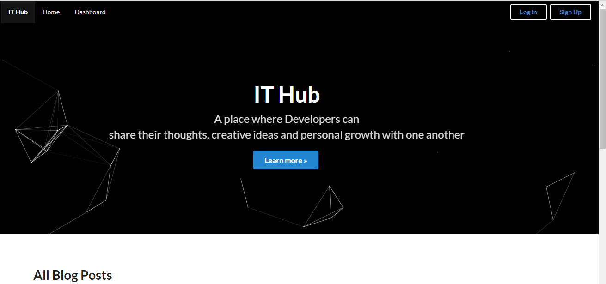
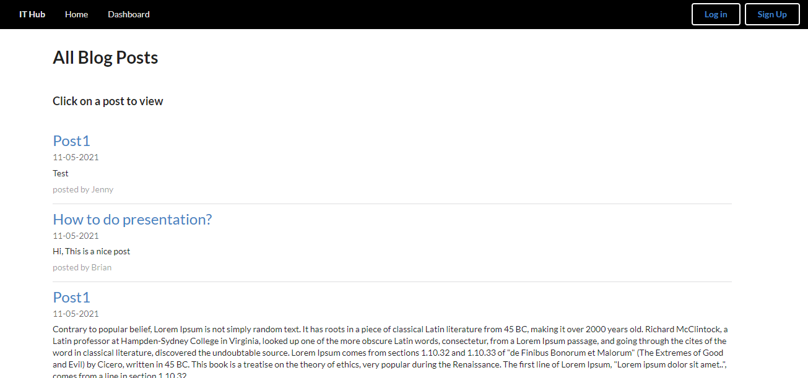
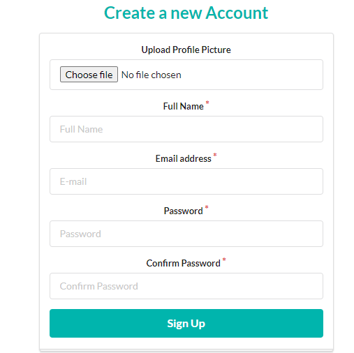
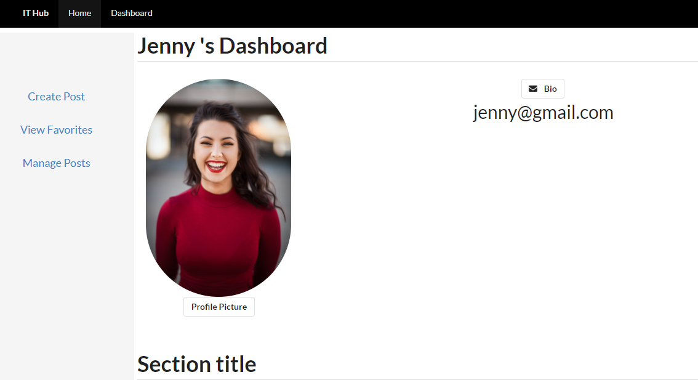

# IT Hub

  ## Project Overview
  
 
IT Hub is a Web app where the developer or anyone can freely create and manage the post about IT or any topic that you would like to share. 
However, only register member can perform the management tasks. 

This is a full stack MERN application with authentication where the user have to create an account and login to create a post. After login the user will be taken to their dashboard page with their profile pictures and information. In their dashboard, they can create a post, remove post, add to Favorite  and remove favorite

 ## Motivation for Development
- An easy to use app 
- It is not too complicated to use
- Is a platform for developer to share their posts
- A Profile page for displaying user’s information
- A Dashboard for user to manage the post

  ## Table of Contents

  * [Installation](#installation)
  * [Usage](#usage)
  * [License](#license)
  * [Contributing](#contributing)
  * [Tests](#tests)
  * [Questions](#questions)

  ## Installation
- To create a react app, run:
npx create-react-app my-app

- In order to run the application, use:
npm start

  ## Technology used
- MERN Stacks : MongoDb, Express, React, Node
- Semantic React
- Passport for authentication
- React Quill for rich Text Editor
- React –particles
- Cloudinary 
 

  ## License
  This Source Code Form is subject to the terms of the  License. 
  If a copy of the License was not distributed with this file, You can obtain one at https://opensource.org/licenses

  ## Link to GitHub:

  [GitHub](https://github.com/wendyVo/IT-Hub.git)

  ## Link to Deployed Applicaion:

  [Deployed Application](https://it-hub-0305.herokuapp.com/)

  ## Screenshots:
  - Header Banner and navigation of the application

  
   
  - List of the post has been created by user
  
   
  - Signup form
  
   
  - Dashboard of the user after login
  
  
  

  ## Questions
Please contact me should you have any questions:  
:email:   Email: uyen199247@gmail.com  
:octocat: GitHub:  [wendyVo](https://github.com/wendyVo)

  